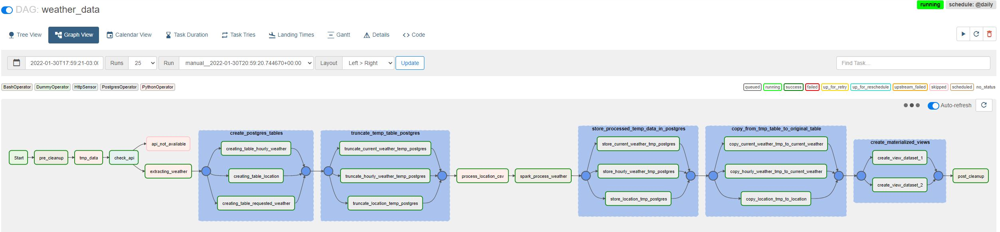
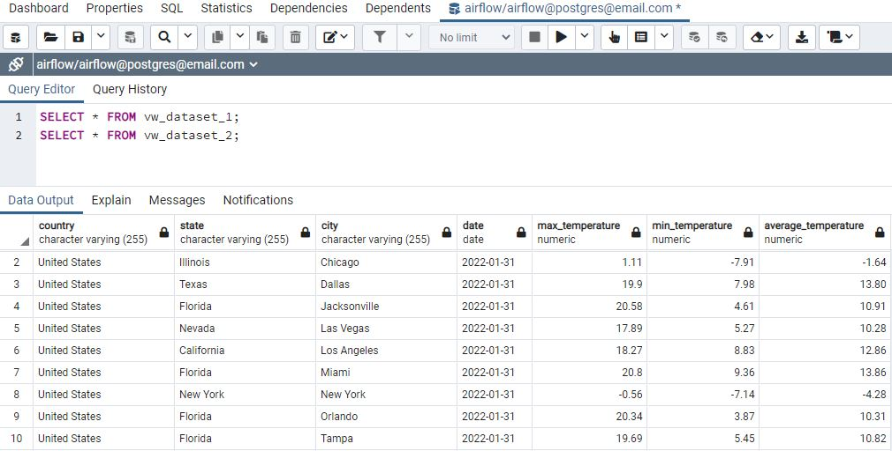

# Apache Airflow data pipeline
## Consuming Weather API and Storing on PostgreSql Database.

### This set of code and instructions has the porpouse to instanciate a compiled environment with set of docker images like airflow webserver, airflow scheduler, postgresql, pyspark.

## Overview
Với thông tin call API của 2 trang web sau.
https://openweathermap.org/
https://weatherapi.com/

    
  
## Requirements
* Linux Operational System (Ubuntu 20.04 Prefered) or Windows and docker desktop.
* [Git Versioning Software ](https://git-scm.com/download/linux)
* [Docker Container Virtualization Software](https://docs.docker.com/engine/install/ubuntu/)
* [Docker-Compose multi-container Docker applications](https://docs.docker.com/compose/install/)


# Instructions
Clone this repository into your linux working directory and navegate into it.  
  
run commands:
```
# Create Local Folder and give permissions
sudo mkdir airflow && sudo chmod -R 777 airflow && cd airflow

# Clone Git repository to the created folder
git clone https://github.com/

# Run docker compose
sudo docker-compose up -d

# Cách 1: Import Airflow connections and variables
docker exec -it airflow-airflow-scheduler-1 airflow connections import /opt/airflow/variables/airflow_connections.json
docker exec -it airflow-airflow-scheduler-1 airflow variables import /opt/airflow/variables/airflow_variables.json


Cách 2: Thực hiện thêm thông tin bằng thủ công


## Accesses
Access the Airflow UI through the link http://localhost:8080/  

Username: airflow  
Password: airflow
  
Access Postgres Admin through the link http://localhost:15432/  
Username: postgres@email.com  
Password: postgres
  
Note: using localhost as example, in case the application sits on cloud virtual machines, the host will be given at your cloud machine instance, also make sure the ports are opened.
  
  
## Data Pipeline Run
Go to airflow DAGs view , turn on the dag weather_data, and trigger it.  



## Checking DAG result

Open the postgres admin in a chrome web browser, go to Servers and add a server with the information described in the json file [pgadmin.json](pgadmin.json)
  
Check the final views  

SELECT * FROM VW_DATASET_1;  

SELECT * FROM VW_DATASET_2;  
  
After running the airflow DAG pipeline, you should expect the following view result in postgresl:  
  



